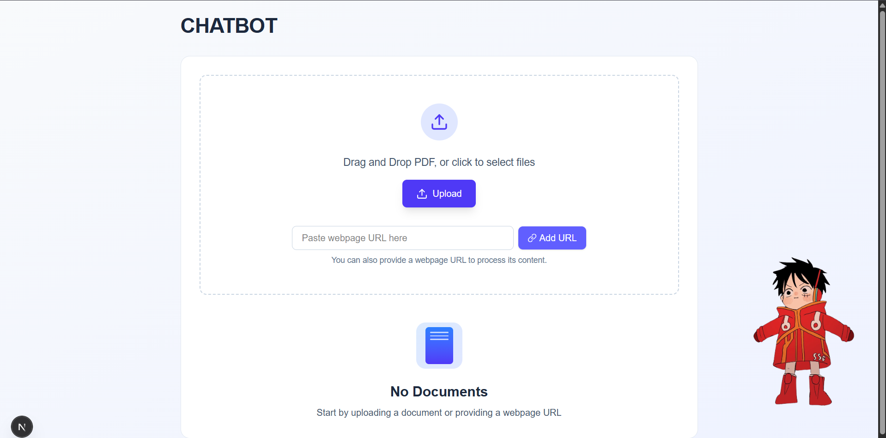
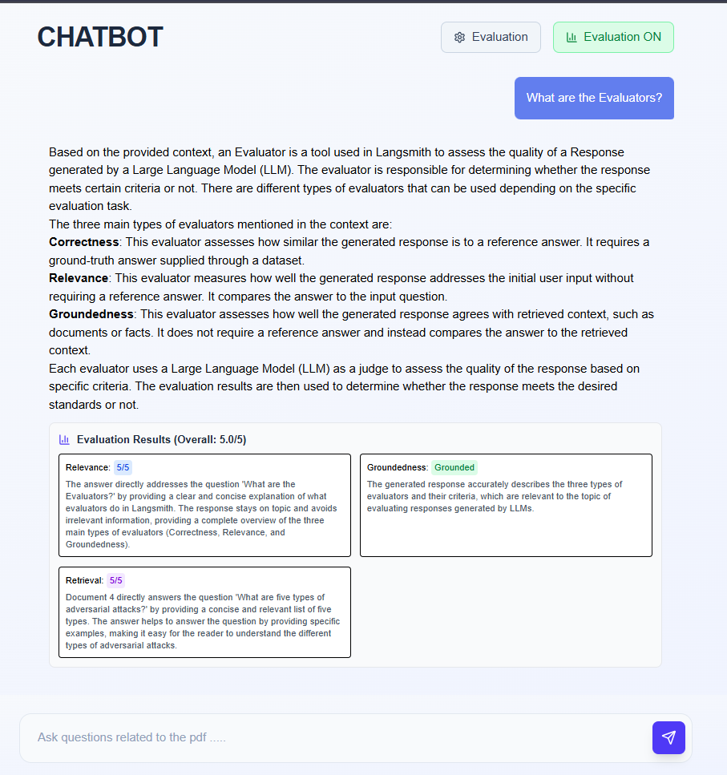

# Multi-Agent FullStack RAG Pipeline

A comprehensive multi-agent RAG system with intelligent agent communication, real-time evaluation, and advanced content processing capabilities.

## 🎯 Key Features

- 🤖 **Multi-Agent Communication**: Message bus architecture with shared memory
- 📊 **Real-time Evaluation**: 4-metric assessment system with detailed feedback
- �️ **Advanced Content Processing**: PDF and web content extraction
- 📈 **Performance Monitoring**: Agent activity tracking and health monitoring
- ⚡ **Modern UI**: Next.js frontend with evaluation interface

---

## 🚀 System Workflow

### **Step 1: Content Upload & Processing**


**Process Flow:**
```
User Upload → Document Agent → Text Chunking → Vector Storage → Ready for Queries
```

### **Step 2: Interactive Chat Interface**


**Chat Features:**
- Real-time messaging with markdown support
- Evaluation toggle for quality assessment
- Ground truth input for correctness testing

### **Step 3: Intelligent Query Processing**

**PDF Processing Example:**


**Web Content Processing Example:**


### **Step 4: Real-time Evaluation System**



**Evaluation Metrics:**
- ✅ **Correctness**: Answer accuracy against ground truth
- 🔍 **Relevance**: Question-answer alignment (1-5 scale)
- 🎯 **Groundedness**: Context-based answer validation
- 📊 **Retrieval Quality**: Document relevance assessment

---

## 🏗️ Multi-Agent Architecture

### **System Architecture Overview**
```
┌─────────────────┐    ┌─────────────────┐    ┌─────────────────┐
│   Document      │    │   Web Scraping  │    │   Evaluation    │
│     Agent       │    │     Agent       │    │     Agent       │
└─────────┬───────┘    └─────────┬───────┘    └─────────┬───────┘
          │                      │                      │
          └──────────────┬───────────────┬──────────────┘
                         │               │
                ┌─────────▼───────┐    ┌──▼──────────────┐
                │  Message Bus    │    │  Shared Memory  │
                │  Coordinator    │    │     Store       │
                └─────────┬───────┘    └─────────────────┘
                          │
                ┌─────────▼───────┐
                │ RAG Orchestrator│
                │   (Main API)    │
                └─────────────────┘
```

### **Agent Communication Flow**

**1. Message Bus System**
- **Centralized Hub**: All agents communicate through a single message bus
- **Async Messaging**: Non-blocking message passing between agents
- **Event Broadcasting**: Status updates propagated to all interested agents

**2. Shared Memory Architecture**
```python
# Agent A stores data
shared_memory.set("pdf_chunks", processed_data)

# Agent B retrieves data
data = shared_memory.get("pdf_chunks")
```

**3. Agent Coordination Example**
```
📄 Document Agent: "PDF processing started"
    ↓
🔄 Message Bus: Broadcast to System Coordinator
    ↓
💾 Shared Memory: Store processing results
    ↓
📊 Evaluation Agent: "Ready for evaluation"
    ↓
✅ System Coordinator: "Pipeline ready"
```

### **Specialized Agent Roles**

**🤖 Document Processing Agent**
- PDF text extraction and chunking
- Metadata preservation
- Status reporting to message bus

**🕷️ Web Scraping Agent**  
- Async HTTP requests
- HTML parsing and cleaning
- Content validation and storage

**📊 Evaluation Agent**
- Multi-metric assessment
- Real-time quality scoring
- Detailed feedback generation

**⚙️ System Coordinator**
- Agent health monitoring
- Activity logging
- Error handling and recovery
---

## 📊 Evaluation Process Deep Dive

### **4-Metric Assessment System**

**1. Correctness Evaluation**
```
Ground Truth Input → LLM Comparison → Binary Score (✅/❌)
├─ Semantic similarity analysis
├─ Factual accuracy check
└─ Key information coverage
```

**2. Relevance Scoring (1-5 Scale)**
```
Question Analysis → Answer Relevance → Numerical Score
├─ Topic alignment verification
├─ Context appropriateness  
└─ Response completeness
```

**3. Groundedness Assessment**
```
Retrieved Context → Answer Validation → Support Score
├─ Citation accuracy check
├─ Hallucination detection
└─ Source material alignment
```

**4. Retrieval Quality (1-5 Scale)**
```
Query Vector → Document Matching → Relevance Score
├─ Semantic similarity measurement
├─ Content coverage analysis
└─ Information completeness
```

### **Evaluation Workflow**
```
User Query → RAG Processing → Answer Generation
     ↓
Evaluation Agent Activation
     ↓
┌─ Correctness ─┬─ Relevance ─┬─ Groundedness ─┬─ Retrieval ─┐
│               │             │               │             │
▼               ▼             ▼               ▼             ▼
LLM Analysis → Score 1-5 → Context Check → Document Score → Combined
     ↓               ↓             ↓               ↓             ↓
✅ Binary      📊 Numerical   🎯 Binary      📈 Numerical   🏆 Overall
     ↓               ↓             ↓               ↓             ↓
User Interface ← ← ← ← Real-time Display ← ← ← ← Color-coded Results
```

### **Real-time Feedback System**
- **Instant Evaluation**: Results displayed immediately with each response
- **Color-coded Metrics**: Visual indicators for quick assessment
- **Detailed Explanations**: Comprehensive reasoning for each score
- **Historical Tracking**: Performance trends and improvement insights

---

## 🔧 API Endpoints

### **Core Operations**
```bash
POST /upload              # PDF processing via Document Agent
POST /url                 # Web content via Scraping Agent  
POST /query               # Standard RAG queries
POST /query_with_evaluation # Queries with real-time evaluation
DELETE /clear             # Clear vector database
```

### **Evaluation Endpoints**
```bash
POST /evaluate/correctness     # Binary accuracy assessment
POST /evaluate/relevance       # 1-5 scale relevance scoring
POST /evaluate/groundedness    # Context support validation
POST /evaluate/complete        # Full 4-metric evaluation
GET /evaluator/health          # Evaluation system status
```

### **Agent Monitoring**
```bash
GET /agents/status        # Real-time agent health
GET /agents/activities    # Recent agent activity logs
GET /agents/shared_data   # Shared memory inspection
```

---

## 🚀 Quick Start

### **Backend Setup**
```bash
# Install dependencies
pip install -r backend/requirements.txt

# Start FastAPI server
cd backend && python rag.py

# Verify Ollama models
ollama list | grep -E "(mxbai-embed-large|llama3)"
```

### **Frontend Setup**  
```bash
# Install and start Next.js
cd chatbot
npm install && npx next dev
```

### **Access Points**
- **Frontend**: http://localhost:3000
- **API Docs**: http://localhost:8000/docs
- **Agent Status**: http://localhost:8000/agents/status

---

## 🎯 System Benefits

✅ **Modular Architecture**: Independent, specialized agents  
✅ **Real-time Evaluation**: Instant quality feedback  
✅ **Transparent Operations**: Complete activity visibility  
✅ **Scalable Design**: Easy agent addition and modification  
✅ **Robust Error Handling**: Isolated failure management  
✅ **Modern UI/UX**: Responsive design with rich interactions  

**Technologies**: FastAPI • LangChain • ChromaDB • Ollama • Next.js • TypeScript


